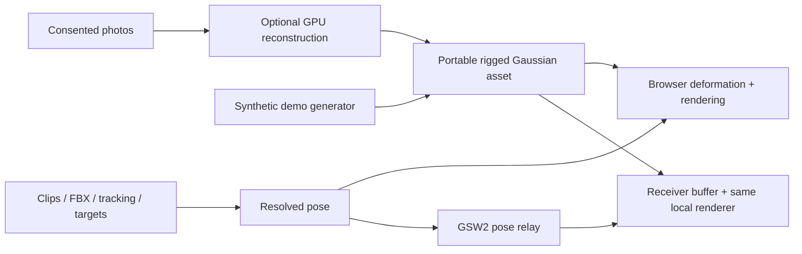

# Gaussian Avatar Lab

Photo-to-avatar research, with a browser-first proof of generation, animation and pose transport.

[Read the visual architecture](https://jamesyong-42.github.io/gaussian-avatar-lab/) · [Generation setup](docs/generation.md) · [Technical contracts](web/CONTRACTS.md) · [Evidence & limits](docs/evidence.md)

This repository turns an exported rigged Gaussian asset into an interactive character: pose it, drive it with head/hand targets, retarget FBX motion, record a performance, and replay it in a second browser. Reconstruction uses upstream **LHM / LHM++**; our work is the model adapters, portable runtime, controls, verification and transport—not a newly trained foundation model or an invented skinning method.

## Run in a few minutes

Install **Git, Python 3.10+ and Node.js 24 LTS**. Use a desktop Chromium browser with hardware acceleration. The quick start needs no CUDA, model account, personal photos or neural weights.

```sh
git clone https://github.com/jamesyong-42/gaussian-avatar-lab.git
cd gaussian-avatar-lab
python scripts/setup.py
python scripts/serve.py
```

Open **http://127.0.0.1:8765**. On systems where Python is named `python3`, use that instead. Stop with Ctrl+C; use `python scripts/serve.py --port 8875` if 8765 is occupied. No virtual-environment activation is necessary.

Setup creates an isolated `.venv`, installs locked npm dependencies, builds the frontend and generates an original **4,636-splat synthetic avatar**. It does not download research models or modify another Python environment. The synthetic avatar has no source photos, learned face expressions or native-reference fixtures. It demonstrates the software path, **not reconstruction quality**.

### Try it

1. Play **Wave / Walk / Squat / Turn**, show the skeleton, or adjust individual joints.
2. Use **VR signals** to move head and hand targets. These are simulated calibrated targets, not a connected headset.
3. Record, stop and replay a performance; download the resolved-pose JSON if desired.
4. Select **Open receiver**. Another browser window loads the same asset and receives pose packets, not rendered video. Inject delay, jitter and loss in the receiver.
5. Import your own licensed Mixamo FBX in the **Mixamo** tab. Camera tracking and the example motion require [optional downloads](docs/development.md#optional-camera-and-motion-assets).

For actual photo reconstruction, complete the separate [GPU generation setup](docs/generation.md), enable generation in `.env`, and restart. Only process photos you have permission to use.

## What is included?

| Track | Status | Extra requirements |
| --- | --- | --- |
| Synthetic avatar, renderer, controls, recording, relay | Runnable quick start | Desktop WebGL2 browser |
| LHM 500M / 1B single-photo generation | Native exporter integrated; GPU setup is separate | Author source, compatible CUDA environment, weights and licensed priors |
| LHM++ 1–8-photo generation | Experimental integrated adapter | Separate Linux/NVIDIA Docker environment and assets |
| IDOL full deformation | Isolated research track, not in the main model picker | See [lab guide](generation-lab/idol/README.md) |
| Unity / Meta / Quest | Early scaffolding and future validation | **Not a shipping Unity package** |



## Repository map

```text
docs/              Architecture website and operating guides
web/               Browser app, lightweight API, native export adapters, tests
generation-lab/    LHM-family experiments and isolated IDOL work
experimental/      Earlier Python/C# protocol and Unity sketches
scripts/           Setup, launch, diagnostics, tests and publication checks
local/             Generated demo, uploads and outputs (ignored; created locally)
third_party/       Optional upstream checkouts (ignored; never bundled)
```

Native model environments are intentionally separate from the lightweight API. All local artifacts, captures, checkpoints, caches, optional tracking/motion files and credentials are ignored. No Git LFS or binary model downloads are needed to clone this repo.

## Development

```sh
python scripts/doctor.py
python scripts/test.py
```

The default tests use synthetic data and mocks. Native-reference and real-FBX checks skip explicitly when their optional inputs are absent; green CI does not mean GPU reconstruction or image quality has been validated. See [development and browser tests](docs/development.md).

Configuration is documented in [.env.example](.env.example) and [configuration](docs/configuration.md). Copy the example to `.env` only when overriding defaults; do not commit it.

## Deployment and safety

The application binds to **loopback only** and is a single-user research preview, not a multi-tenant service. Uploads and avatars persist on the server. Anyone admitted through a shared-password gateway can access that library. Never expose the bare API or publish personal captures in GitHub issues.

**GitHub Pages serves the architecture document only**, not the interactive prototype or generation backend. The Pages workflow copies only the audited documentation page into its artifact. See [deployment](docs/deployment.md) and [security](SECURITY.md).

## Research, attribution and license

See the [21-paper architecture review](https://jamesyong-42.github.io/gaussian-avatar-lab/#papers), [research roadmap](docs/research.md) and [third-party notices](THIRD_PARTY_NOTICES.md). Model, checkpoint, SMPL-X/FLAME, dataset and motion rights are separate. None of those assets are redistributed here.

An open-source license for the original project code has **not yet been selected**. Public visibility is not a license grant; see [license status](LICENSE-STATUS.md). Third-party components retain their own terms.
